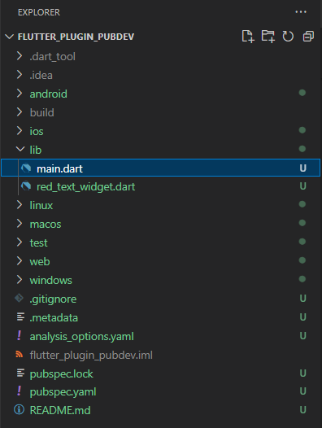
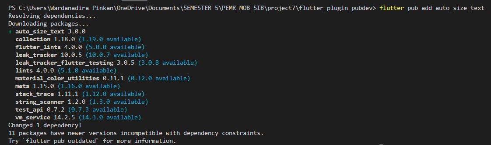
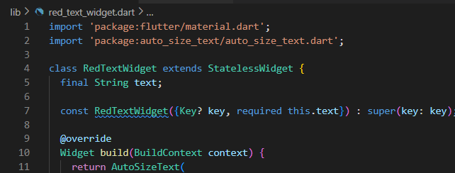
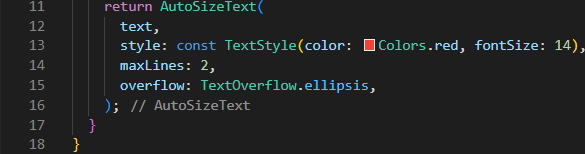
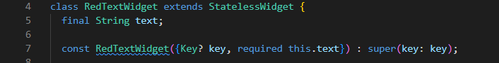
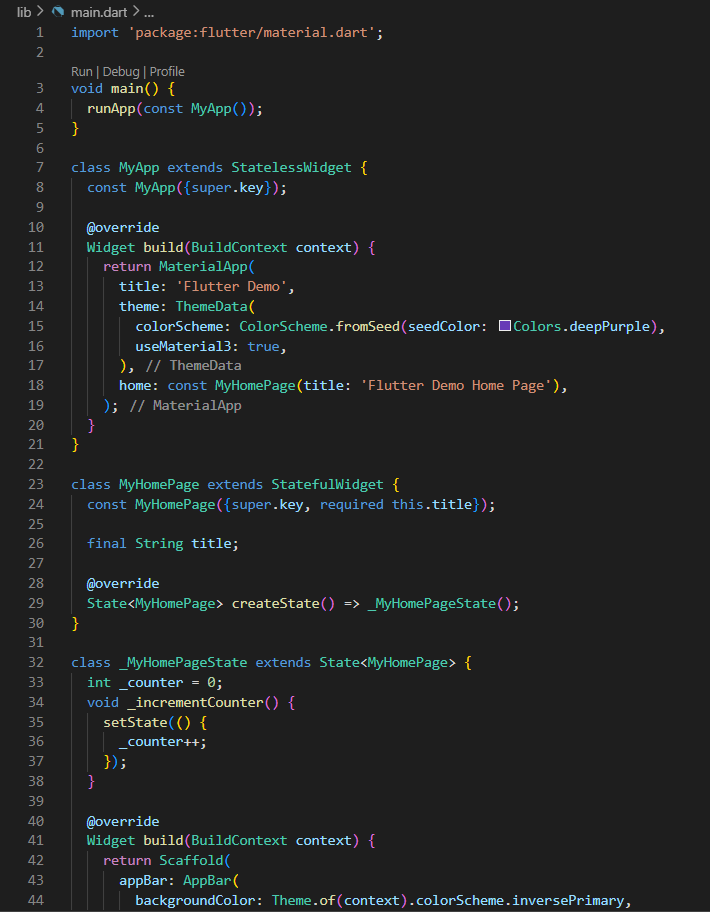
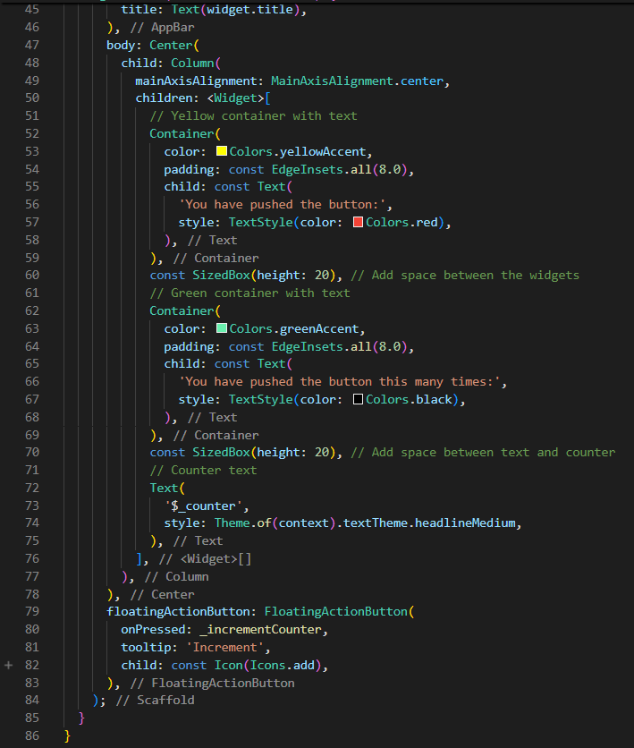
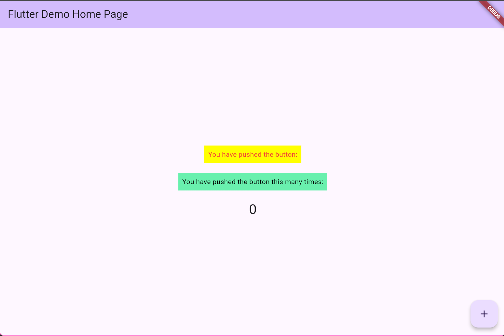

JOBSHEET 7
“Managemen Plugin”

Mata Kuliah [Pemrograman Mobile]
Dosen Pengampu: Ade Ismail, S.Kom., M.TI.

Nama		: Wardanadira Pinkan Dwiyuwanda
NIM		    : 2241760116
Kelas		: SIB-3D
No Absen	: 26

PROGRAM STUDI SISTEM INFORMASI BISNIS
JURUSAN TEKNOLOGI INFORMASI
POLITEKNIK NEGERI MALANG
2024

<<<Langkah 1: Buat Project Baru>>>
Buatlah sebuah project flutter baru dengan nama flutter_plugin_pubdev. Lalu jadikan repository di GitHub Anda dengan nama flutter_plugin_pubdev.
    

<<<Langkah 2: Menambahkan Plugin>>>
Tambahkan plugin auto_size_text menggunakan perintah berikut di terminal
    

<<<Langkah 3: Buat file red_text_widget.dart>>>
Buat file baru bernama red_text_widget.dart di dalam folder lib lalu isi kode seperti berikut.
    

<<<Langkah 4: Tambah Widget AutoSizeText>>>
Masih di file red_text_widget.dart, untuk menggunakan plugin auto_size_text, ubahlah kode return Container() menjadi seperti berikut.
    

Setelah Anda menambahkan kode di atas, Anda akan mendapatkan info error. Mengapa demikian? Jelaskan dalam laporan praktikum Anda!
Jawab:
Error yang terjadi pada kode tersebut disebabkan oleh penggunaan widget AutoSizeText, yang tidak diimport dari package yang sesuai, sehingga perlu dilakukan penambahan dependensi package tersebut pada file pubspec.yaml dan import pada file kode. Selain itu, variabel text yang digunakan pada AutoSizeText belum dideklarasikan atau diberikan nilai, sehingga menyebabkan error karena text belum diinisialisasi.

<<<Langkah 5: Buat Variabel text dan parameter di constructor>>>
Tambahkan variabel text dan parameter di constructor seperti berikut.
    

<<<Langkah 6: Tambahkan widget di main.dart>>>
Buka file main.dart lalu tambahkan di dalam children: pada class _MyHomePageState
Main.dart
    
    
Run aplikasi tersebut dengan tekan F5, maka hasilnya akan seperti berikut.
    